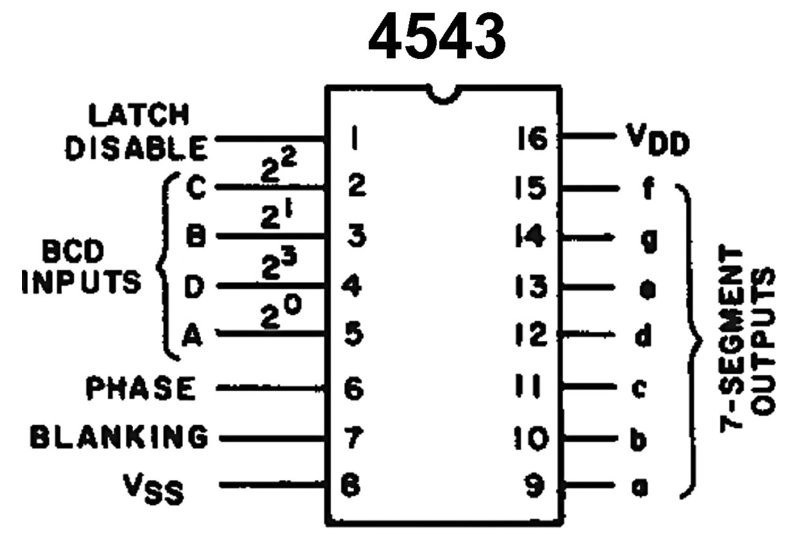
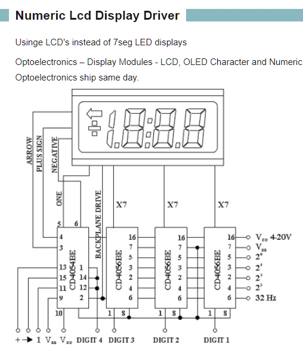
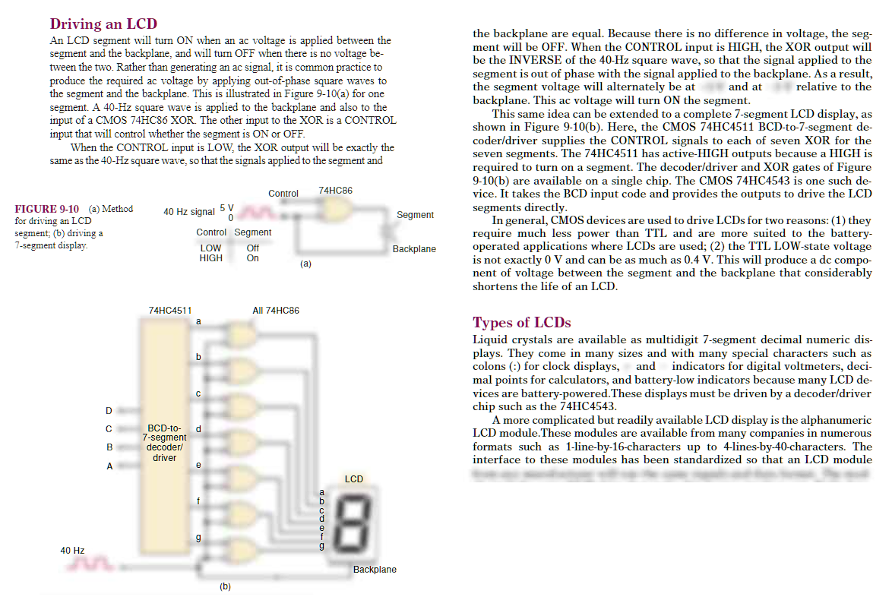
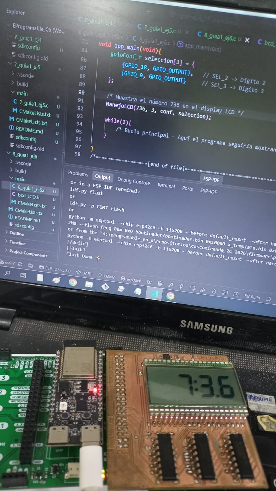
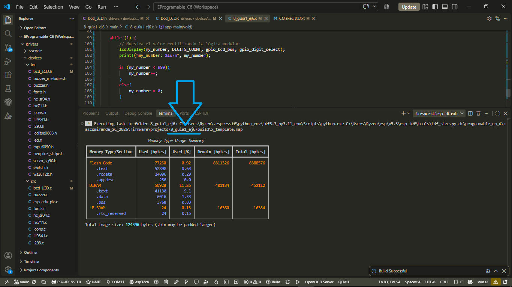
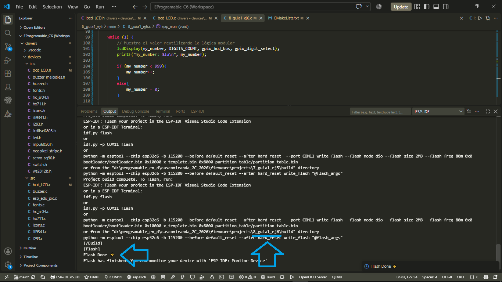
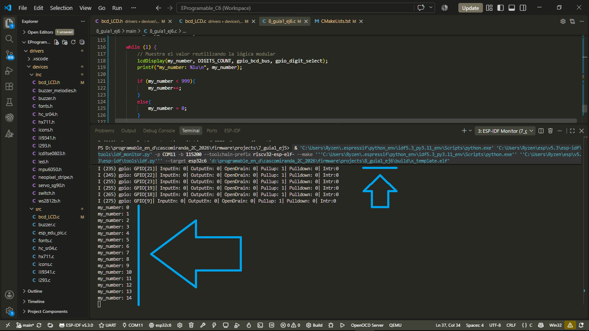

# Guía 1 - Ejercicio 6

## Descripción General
Proyecto de firmware para ESP32 enfocado en la manipulación de displays LCD y el integrado decoder-latch BCD a 7 segmentos HEF4543B.

## Documentación y Adjuntos

* 🖼️ [Pinout del CI 4543](./pinout_4543.jpg)
* 🖼️ [Datasheet HEF4543B](./datasheet_HEF4543B.pdf)
* 🖼️ [Resumen de funcionamiento del LCD](./resumen_LCD.png)
* 🖼️ [Señal AC para el LCD](./senial_AC_para_LCD.png)

* 🖼️ [Ejecución y revisión el 2026-09-03 a las 13:09:41](./Revision_2026-09-03_a_las_13h09m41s.jpeg)
* 🖼️ [Compilación mismo código, pero con display LED](./01_compiled_8_guia1_ej6.png)
* 🖼️ [Flasheo con mismo código, pero con display LED](./02_flashed_8_guia1_ej6.png)
* 🖼️ [Consola con mismo código, pero con display LED](./03_tested_8_guia1_ej6.png)

---

### Previsualización de Recursos

#### Pinout 4543

#### Resumen LCD

#### Señal AC para LCD

#### Ejecución y revisión el 2026-09-03 a las 13:09:41

#### Compilación mismo código, pero con display LED

#### Flasheo con mismo código, pero con display LED

#### Consola con mismo código, pero con display LED

